# NXSand

[](https://github.com/antoinebou12/nxsand/actions/workflows/native-nro.yml)
[](docs/INSTALL.md)
[](https://github.com/antoinebou12/nxsand/blob/main/LICENSE)

**NXSand** is a falling-sand sandbox for Nintendo Switch homebrew. Pour sand, spill water, light fires, grow plants, melt ice, and watch materials react on a live pixel grid. Paint with the touchscreen or Joy-Con, pick materials from a ring, save up to three worlds, and tune performance when you want smoother play on handheld.

**Documentation:** [antoinebou12.github.io/nxsand](https://antoinebou12.github.io/nxsand/) (MkDocs Material site; sources in `docs/`).

The simulation runs on the GPU (OpenGL ES 3.0): a Margolus cellular automaton on ping-pong `GL_R8UI` textures, four fragment or compute passes per step, dirty-rect painting, and a custom OpenGL UI (no ImGui). Desktop builds exist for faster iteration; the Switch `.nro` is the primary target.

## Showcase

Gameplay on Nintendo Switch — materials, reactions, and save slots:

**[▶ Watch gameplay showcase (MP4)](https://github.com/antoinebou12/nxsand/raw/main/docs/media/nxsand-showcase.mp4)**

<video src="docs/media/nxsand-showcase.mp4" controls width="100%">
  <a href="https://github.com/antoinebou12/nxsand/raw/main/docs/media/nxsand-showcase.mp4">Download gameplay video</a>
</video>



## Materials & play

Twenty brush materials (IDs 1–17, 20–22) plus spawn-only **Ember** (18) and **Flower** (19). ID 0 = empty — see [docs/PHYSICS.md](docs/PHYSICS.md):

| Material | Behavior (short) |
|----------|------------------|
| Sand / stone | Powders that fall and pile |
| Water / acid / lava / oil | Fluids (layer by density) |
| Fire / smoke / steam / ember | Gases (ember spawns from fire; not paintable) |
| Wall / plant / ice / glass / wood / metal | Static solids |
| Gunpowder / coal / TNT / salt / brick | Powders and explosives; **brick** is heavy cohesive (no detonation); salt dissolves in water |

Reactions live in `shaders/sim_common.glsl` (included by `sim.frag` / `sim.comp`). Examples: lava + water → stone and smoke; lava + sand → glass; gunpowder + fire → spreading flame.

 — [full diagram catalog](docs/DIAGRAMS.md).

Saves use JSON + base64 slot files (`sdmc:/switch/nxsand/` on Switch, `./nxsand_save/` on desktop). Engine visuals (palette, bloom, flicker, AO, upscale) load from `settings.json` under `visuals` (legacy `render` object is accepted).

## Controls

| Input | Switch | Desktop |
|-------|--------|---------|
| Paint | **A** or **ZR** | **Space** or left mouse |
| Erase | **B** or **ZL** | **Shift** or right mouse |
| Brush size | **L** / **R** | **[** / **]** |
| Material ring | **X** | **H** or **Tab** |
| Quick save | **Y** | **F5** |
| Menu | **+** | **Esc** |
| Move brush | Left stick / D-pad | **WASD** / arrows / mouse position |

## Install on Switch (players)

You need a homebrew-ready Switch ([setup guide](https://switch.hacks.guide/)).

1. Get **`NXSand.nro`** — build it yourself (below), download the latest **NXSand-switch** zip from [GitHub Actions](https://github.com/antoinebou12/nxsand/actions/workflows/native-nro.yml) (`switch/NXSand.nro` inside; optional `NXSand.nsp` forwarder when CI has `SWITCH_PROD_KEYS`), or use a [release](https://github.com/antoinebou12/nxsand/releases) tag (Switch + Linux + Windows portable zips).
2. Copy to the SD card: `sdmc:/switch/NXSand.nro` (unzip the artifact at the card root, or copy `switch/NXSand.nro` into `switch/`).
3. Launch from the Homebrew Menu.

Saves live in `sdmc:/switch/nxsand/`. Legacy `sdmc:/switch/nxengine/` data is migrated on first launch when possible. Full install notes: [docs/INSTALL.md](docs/INSTALL.md).

### Reference versions (May 2026)

These are the versions NXSand is documented against. Update your SD setup and devkitPro packages when newer releases ship.

| Component | Version | Role |
|-----------|---------|------|
| [Atmosphère](https://github.com/Atmosphere-NX/Atmosphere/releases) | **1.11.1** | Custom firmware (homebrew); update **fusee** with each release |
| [hekate](https://github.com/CTCaer/hekate/releases) | **6.5.2** (Nyx **1.9.2**) | Bootloader / payload launcher (HOS up to 22.1.0) |
| [libnx](https://github.com/switchbrew/libnx/releases) | **4.12.0** | Switch homebrew runtime (via devkitPro `switch-dev`) |
| SDL2 | **2.28.5** (`switch-sdl2`) | Switch port from devkitPro; [upstream SDL2](https://github.com/libsdl-org/SDL/releases) is **2.32.0** |

After installing devkitPro, check what you have with:

```bash
dkp-pacman -Q libnx switch-sdl2
dkp-pacman -Syu    # pull newer libnx / switch-sdl2 when available
```

## Build from source

### 1. Install devkitPro

| OS | Install |
|----|---------|
| **Windows** | Download and run the installer from **[devkitPro installer releases](https://github.com/devkitPro/installer/releases)**. Use the **MSYS2** shortcut it adds (e.g. “devkitPro MSYS2”) so `make` and `dkp-pacman` are on your PATH. |
| **Linux / macOS** | Follow **[Getting Started](https://devkitpro.org/wiki/Getting_Started)** on devkitpro.org. |

Set `DEVKITPRO` if your environment does not (the installer usually does).

### 2. Install Switch libraries

In the devkitPro shell:

```bash
dkp-pacman -S switch-dev switch-sdl2 switch-mesa switch-glm switch-freetype switch-harfbuzz
```

### 3. Build the NRO

From the repository root:

```bash
make
```

Output: **`build/NXSand.nro`** (also **`dist/switch/NXSand.nro`** after `make dist`). Copy to `sdmc:/switch/NXSand.nro`. Optional NSP forwarder: `make nsp` or CI with **`SWITCH_PROD_KEYS`** — see [docs/INSTALL.md](docs/INSTALL.md#nsp-forwarder-optional).

CI runs Switch `make`, Linux desktop, and Windows desktop (`build/NXSand.exe` via MSYS2 + ANGLE) on every push to `main`; see the workflow badge above for status.

### Desktop (optional)

For UI and logic work without a Switch. Needs SDL2, OpenGL ES 3.0 (Mesa on Linux/macOS; [ANGLE](https://github.com/google/angle) on Windows), and FreeType.

**Linux / macOS / WSL**

```bash
# Debian/Ubuntu (once): sudo apt install build-essential pkg-config libsdl2-dev libgles2-mesa-dev libegl1-mesa-dev libfreetype6-dev
make desktop
./build/NXSand
make test         # CPU reference tests, no GPU
```

WSL with GUI: `bash scripts/build-desktop-wsl.sh` then `powershell -File scripts/run-desktop-wsl.ps1`.

**Windows (MSYS2 MinGW64)**

1. Install [MSYS2](https://www.msys2.org/) if needed, then in the **MINGW64** terminal:

```bash
pacman -S --needed mingw-w64-x86_64-gcc mingw-w64-x86_64-make mingw-w64-x86_64-SDL2 mingw-w64-x86_64-freetype mingw-w64-x86_64-angleproject
```

2. Build and run from the repo root:

```powershell
powershell -File scripts/build-desktop.ps1
powershell -File scripts/run-desktop.ps1
```

The build copies `libEGL.dll` and `libGLESv2.dll` into `build/`; `run-desktop.ps1` also adds MSYS2 to `PATH` if needed. Always launch with the **repo root** as the working directory so `shaders/` resolves.

Or from MSYS2: `bash scripts/build-desktop-msys.sh` then `cd` to the repo root and `./build/NXSand.exe`.

Plain `make desktop` in PowerShell or devkitPro MSYS2 usually fails (missing MinGW SDL2/GLES/GLAD). Use the scripts above instead.

Saves go to `./nxsand_save/`; legacy `./nxengine_save/` is migrated when possible.

## Project layout

| Path | Role |
|------|------|
| `source/platform/main.cpp` | Entry, romfs, fatal screen |
| `source/game/app.*` | Frame loop, sim tick, render |
| `source/gpu/sim_pipeline.*` | Ping-pong grid, Margolus passes, GPU brush |
| `source/gpu/render_pipeline.*` | Palette, bloom, world draw |
| `shaders/sim.frag` | Cellular automaton rules |
| `shaders/paint.frag` | Dirty-rect brush stamp |
| `shaders/palette_lookup.frag` | Material ID → color |
| `source/save/save.cpp` | JSON save slots |

Deeper write-ups: [docs site](https://antoinebou12.github.io/nxsand/) · [docs/NATIVE.md](docs/NATIVE.md) · [docs/ARCHITECTURE.md](docs/ARCHITECTURE.md) · [docs/PHYSICS.md](docs/PHYSICS.md) · [docs/INSTALL.md](docs/INSTALL.md)

## License

MIT — see [LICENSE](https://github.com/antoinebou12/nxsand/blob/main/LICENSE).
