# CI and releases

NXSand uses GitHub Actions for continuous build and manual release packaging.

## Workflows

| Workflow | Trigger | Output |
|----------|---------|--------|
| [`native-nro.yml`](https://github.com/antoinebou12/nxsand/blob/main/.github/workflows/native-nro.yml) | Push / PR to `main` | `make test`, Switch `make` + `make dist`, Linux and Windows desktop sanity builds |
| [`release.yml`](https://github.com/antoinebou12/nxsand/blob/main/.github/workflows/release.yml) | `workflow_dispatch` + tag | Portable zips via `scripts/package-release.py`, GitHub Release assets |
| [`docs.yml`](https://github.com/antoinebou12/nxsand/blob/main/.github/workflows/docs.yml) | Push to `main` (docs paths) | GitHub Pages site |

## CI artifact (Switch)

**NXSand-switch** zip contains `switch/NXSand.nro`. When repository secret **`SWITCH_PROD_KEYS`** is set, CI also runs `scripts/export-nsp.py` and adds **`switch/NXSand.nsp`**. Unzip at the SD card root so the file lands at `sdmc:/switch/NXSand.nro`.

## NSP export

| Item | Detail |
|------|--------|
| Script | `scripts/export-nsp.py` (wraps [NTON](https://github.com/rlaphoenix/nton)) |
| Make target | `make nsp` (after `make dist`) |
| Keys | `prod.keys` locally; **`SWITCH_PROD_KEYS`** GitHub secret for CI |
| Output | `dist/switch/NXSand.nsp` → bundled in Switch CI/release zips when present |

See [Installing NXSand](INSTALL.md#nsp-forwarder-optional) for end-user install notes.

## Release zips

| Zip | Contents |
|-----|----------|
| `NXSand-switch-v*.zip` | `switch/NXSand.nro`; optional `switch/NXSand.nsp` |
| `NXSand-linux-v*.zip` | `NXSand`, `shaders/`, `romfs/fonts/`, `run.sh` |
| `NXSand-windows-v*.zip` | `NXSand.exe`, `NXSand-run.bat`, ANGLE/SDL DLLs, `shaders/`, fonts |

Local dry-run of the release workflow:

```powershell
powershell -File scripts/run-act-ci.ps1 -Workflow release -Tag v0.0.1
```

## Documentation deployment

The docs workflow builds with MkDocs Material and publishes to:

**https://antoinebou12.github.io/nxsand/**

Enable **Settings → Pages → Build and deployment → GitHub Actions** if the site does not appear after the first successful docs run.


