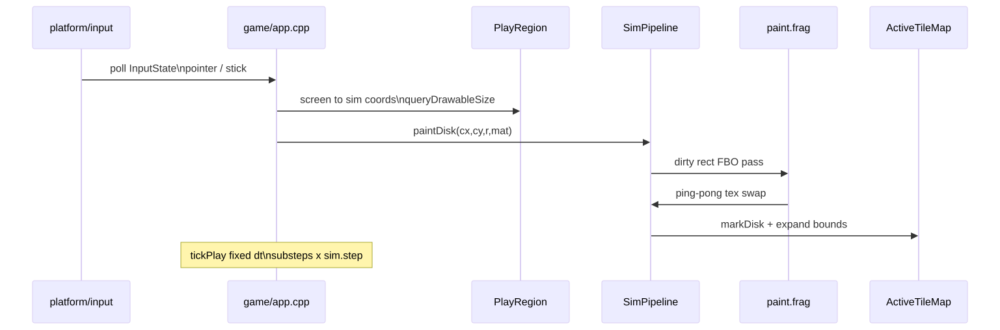

# Controls

NXSand is **Joy-Con first** on Switch and **mouse + keyboard** on desktop. Face buttons use Nintendo naming (A/B/X/Y) via `switch_face.hpp`, not positional SDL button indices on switch-sdl2.

## In play

=== "Nintendo Switch"

| Action | Input |
|--------|--------|
| Paint | **A** or **ZR** |
| Erase | **B** or **ZL** |
| Brush size | **L** / **R** |
| Material ring | **X** |
| Quick save | **Y** |
| Menu | **+** |
| Move brush | Left stick / D-pad |

=== "Desktop"

| Action | Input |
|--------|--------|
| Paint | **Space** or left mouse |
| Erase | **Shift** or right mouse |
| Brush size | **[** / **]** or mouse wheel |
| Material ring | **H** or **Tab** |
| Quick save | **F5** |
| Menu | **Esc** |
| Move brush | **WASD**, arrows, or mouse over the sandbox |

## Menus

- Navigate lists with D-pad / stick / arrows; **confirm** with A (Switch) or Enter (desktop); **back** with B or Esc.
- On **slider rows** in Engine Settings and Element Settings, **hold** D-pad or arrow keys to repeat adjust (`menu_repeat`). Toggle rows change one step per press.
- Material selection uses the **ring wheel only** (no grid picker, no digit hotkeys).

## Touch (desktop)

Pointer coordinates map through `queryDrawableSize` and `PlayRegion` into grid space, same as the software cursor.

## Optional Switch env

| Variable | Effect |
|----------|--------|
| `NXSAND_SWITCH_SWAP_FACE_XY` | Swaps ring face buttons X/Y |

## Input → GPU brush

See [Architecture](ARCHITECTURE.md) for drawable size, orientation, and `PlayRegion` layout.
