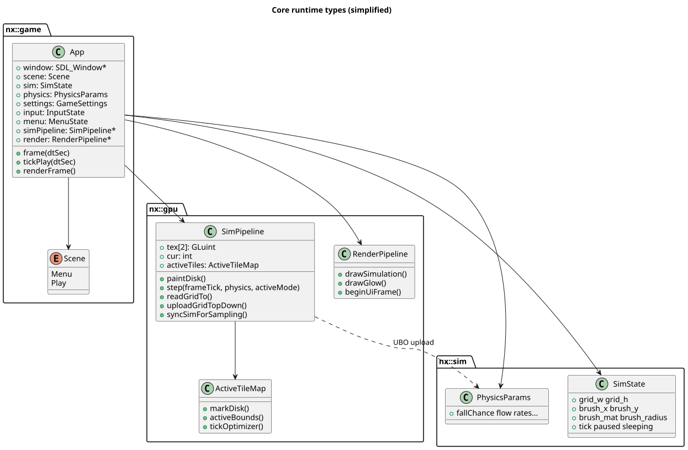
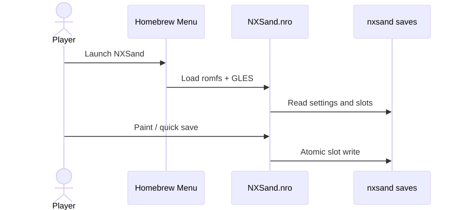

# Settings and saves

NXSand splits **engine** settings from **element physics**. Changing either does **not** reset the active save slot. Brush radius in `settings.json` applies globally (including after slot load).

## Save locations

| Platform | Path |
|----------|------|
| Switch | `sdmc:/switch/nxsand/` |
| Desktop | `./nxsand_save/` |

Legacy folders (`nxengine` / `nxengine_save`) migrate forward on first launch when the new folder is empty.

## Files

| File | Purpose |
|------|---------|
| `settings.json` | Engine, display, performance, visuals, controls, accessibility, debug |
| `physics.json` | Per-element tunables (Element Settings) |
| `slot0.json` … `slot2.json` | World grids (JSON + base64), brush state, timestamp |
| `launch.log` | Fatal / startup diagnostics (Switch, when writable) |

## Engine settings (`settings.json`)

Key groups:

- **Display** — orientation (Auto / Landscape / Portrait), safe areas.
- **Performance** — sim resolution preset, substeps, active tiles (Off / Conservative / Aggressive), dynamic resolution, sim shader (fragment vs compute), idle sleep.
- **Visuals** — palette mode (Pretty / Fast / Classic / debug IDs), ambient occlusion, flicker, grain, upscale filter, bloom level. Loaded from `visuals`; legacy `render` object is accepted. Missing `visuals.flicker` defaults to **off**.
- **Controls** — brush radius (flushed immediately when changed in menus).

Heavy GPU changes (sim resize, backend switch) defer **one frame** after leaving Engine Performance (`schedulePendingHeavySettingsFlush`) so Back does not stall on reinit.

Disk writes are queued: one file per frame on tab back, menu exit, or shutdown (Switch matches desktop). Desktop shows a save-in-progress overlay during writes.

## Element settings (`physics.json`)

Tunables map to the `PhysicsBlock` UBO (`source/sim/physics_gpu.hpp`) and `shaders/sim_common.glsl`. Examples: water flow rates, plant growth, acid corrode, gunpowder chain, salt dissolve.

Presets (Battery Saver / Balanced / Quality) adjust sim size and substeps on Switch; see [Switch performance matrix](SWITCH_PERF_MATRIX.md).

## Save / load flow

Slot format and GPU upload details: [Architecture → Persistence](ARCHITECTURE.md#persistence).
