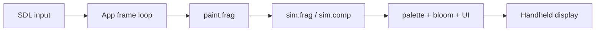

# NXSand

**NXSand** is a falling-sand sandbox for Nintendo Switch homebrew. Pour sand, spill water, light fires, and watch a **GPU Margolus cellular automaton** run at handheld-friendly resolution. Paint with Joy-Con or touch, pick materials from a ring, save three worlds, and tune performance when you need smoother play.

The primary artifact is **`NXSand.nro`**. Desktop builds (SDL2 + OpenGL ES 3.0 + ANGLE on Windows) exist for faster iteration; Switch hardware remains the performance target.

## Quick links

| I want to… | Start here |
|------------|------------|
| Install on a Switch | [Install on Switch](INSTALL.md) |
| Learn controls | [Controls](CONTROLS.md) |
| Understand materials | [Physics & materials](PHYSICS.md) |
| Build from source | [Native build](NATIVE.md) |
| Read the runtime design | [Architecture](ARCHITECTURE.md) |
| Browse diagrams | [Diagram catalog](DIAGRAMS.md) |

## Showcase

Gameplay on Nintendo Switch (materials, reactions, save slots):

<video src="media/nxsand-showcase.mp4" controls width="100%">
  <a href="media/nxsand-showcase.mp4">Download gameplay video</a>
</video>

## How it works (short)

Each sim step runs **four Margolus phases** on ping-pong `GL_R8UI` textures. Rules live in `shaders/sim_common.glsl`. Presentation uses a custom OpenGL UI (quads + font atlas) — no ImGui and no `SDL_Renderer` for gameplay.

## Downloads

- **Releases** — [GitHub Releases](https://github.com/antoinebou12/nxsand/releases) (Switch, Linux, and Windows portable zips).
- **CI artifacts** — [native-nro workflow](https://github.com/antoinebou12/nxsand/actions/workflows/native-nro.yml) uploads `NXSand-switch.zip` with `switch/NXSand.nro`.

## Materials (overview)

Seventeen brush materials (IDs 1–17) plus spawn-only **Ember** (18). ID 0 is empty. Full tables and reaction notes: [Physics & materials](PHYSICS.md).

## License

MIT — see [LICENSE](https://github.com/antoinebou12/nxsand/blob/main/LICENSE).
